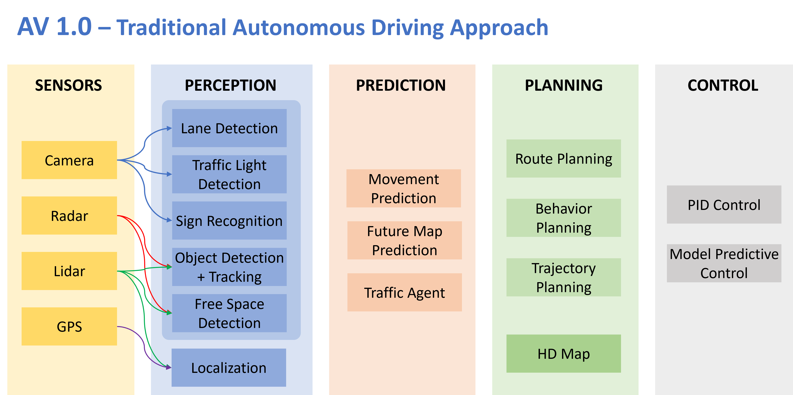
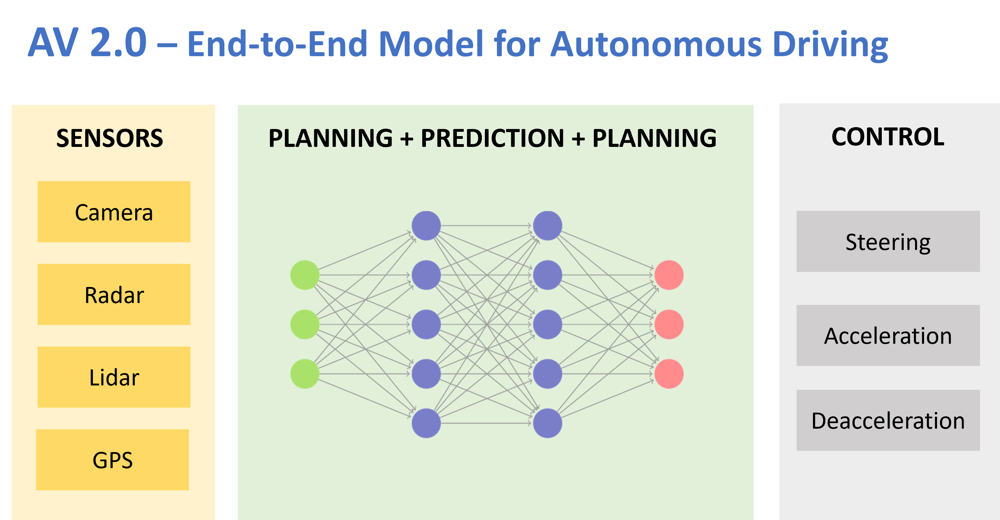

# AV1.0 vs. AV2.0 - Conventional AV vs. E2E Neural Network Model
The modern Autononoums driving architectures today replacing conventional modular pipeline tasks, with separate components for object detection and tracking, mapping & localization, trajectory prediction, and path planning and control with end-to-end AI models encapsulating entire pipeline tasks into a single module, leveraging an end-to-end deep neural networks.

Conventional autonomous driving systems use multiple software modules that link together to form complex working systems. In contrast, the E2E approach delegates all decision-making to a machine learning (ML) model, which focuses on developing the model and generating data for it to use.

E2E autonomous driving relies on decisions made by a black-box ML model, which raises safety concerns that make it an unacceptable risk to major automotive companies. However, last year’s release of Tesla’s near-human-level FSD v12 is increasing interest in E2E autonomous driving.

Traditional autonomous driving approach is a complex system that operates by connecting a large number of small modules

End-to-end autonomous driving uses a single model that uses sensors mainly cameras as inputs to generate the vehicle’s actions.

