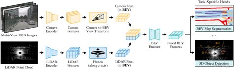
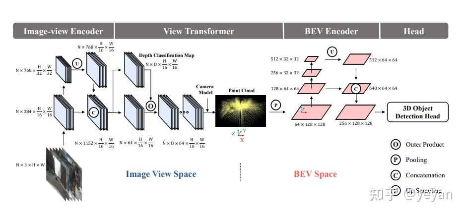
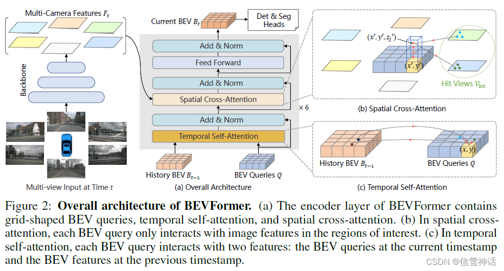

# :camera: Perception
- [Overview]()
- [Conventional Approach]()
    - [Object Detection]()
        - [Measures]()
    - [Semantic Segmentation]()
        - [Measures]()
    - [Object Tracking]()
        - [Measures]()
        - [Kalman Filters]()
        - [Multi Object Trackers]()
- [ML Model based Approaches]()
    - [Bird-Eye-View (BEV)]()
        - [BEVFusion]()
        - [BEVFormer]()
    - [Occupancy Networks]()

## Perception Overview

> Perception refers to the processing and interpretation of sensor data to detect, identify, classify and track objects.

Perception provides information about surroundings, static and movable obstacles. Perception helps car to see the world around itself, as well as recognize and classify the things that it sees.
- The car needs to see and classify traffic lights, pedestrians, road signs, walkways, parking spots, lanes, and much more.
- Not only that, it also needs to know the exact distance between itself and the objects around it.

To achieve such a high level of perception, a self-driving car should use one or more below sensors:
- Camera
- LiDAR
- RADAR

multi-object trackers (MOT).

simple online and real-time tracker (SORT) that uses a Kalman filter for state estimation and a data association algorithm for target association based on the target bounding boxes from the detector. 

detection errors include partial or double detections and missed detections
 environmental occlusions

 The accuracy of object tracking plays a critical role in robust distance-to-object and object velocity estimations.

vehicle tracking, Pedestrian tracking

Multi-Sensor Kalman Filter

### Object Detection

Object Detection: A 2D object detection model (e.g., YOLO, Faster R-CNN) processes the image to detect objects like vehicles and pedestrians, resulting in 2D bounding boxes in the image frame, along with class labels (car, pedestrian, etc.) and confidence scores.

### Camera Image-Based Object Detection with YOLO
 
For image-based object detection, deep learning models like YOLO (You Only Look Once) are commonly used. YOLO takes a 2D camera image as input and produces:
 
2D bounding boxes around detected objects.
 
Object class labels (e.g., vehicle, pedestrian).
 
Confidence scores for each detection.
 
While YOLO can provide detailed classification and detection in 2D, it lacks depth information (i.e., how far the object is from the vehicle), which is where LiDAR becomes crucial.

## Semantic Segmentation

Segmentation: Uses RANSAC to identify inliers and outliers, fitting a geometric model to the data.

## Object Tracking

There are two main types of tracking algorithm family: 
1) Single Object Tracker (SOT)
2) Multiple Object Tracker (MOT)
   
Multiple Object Tracking (MOT) refers to the computer vision task that addresses to track every single object of interest in the images or videos. In usual case, MOT integrates a technique known as tracking-by-detection. It entails running a tracker on the set of detections after an independent detector has been applied to images or videos in order to gather expected detections. Unique IDs are then assigned to the bounding box of detected objects and estimation algorithms are used to track moving object’s future actions without losing assigned IDs. As conclusion, the following three steps are shared by the majority of MOT algorithms in high level:
- Detect objects
- Create a unique ID for each detected objects
- Track object as they move, maintaining the assigned IDs.

After object detection, each detected object is represented by a bounding box (from the image or LiDAR) and additional features (e.g., class labels, position, velocity). These detections become the measurements for the Kalman filter, which tracks the objects over time.

### real-time object tracking methods.

#### Primitive Techniques

### Kalman filters

State Estimation: Kalman filter is applied to to predict the future location of the target by optimally solving the velocity components. Then the detected bounding box in the previous step is used to update the target state.
Target Association: Kalman filter just estimates the object’s new location, which needs to be optimized. 

Hungarian algorithms 

Step 5: Feeding Fused Results into Kalman Filter for Tracking
 
Once the objects have been detected and classified using late fusion, their positions and attributes (e.g., 3D bounding boxes, class labels) are used as inputs for a Kalman filter to track these objects across time.
 
Kalman Filter Input: For each object, the Kalman filter takes the fused bounding box coordinates (x, y, z) and class label and predicts the next state of the object in terms of its position and velocity.
 
Tracking: As new detections come in at each time step, the Kalman filter updates the object's position and motion model, allowing for robust tracking of objects as they move, even if one sensor fails to detect an object in a particular frame.
 
 
The Kalman filter helps:
 
Smooth object motion by predicting positions between detections.
 
Handle missing detections when an object is temporarily occluded or one sensor misses it.
 
Track multiple objects by associating their positions over time.

 Object Detection as Input to Kalman Filter
 

 
LiDAR provides 3D bounding box coordinates (position and size) in the real-world space (e.g., x, y, z).
 
Cameras provide 2D bounding box coordinates (position in the image plane), along with class labels (e.g., pedestrian, car).
 
 
Both sets of information can be fused to form a comprehensive detection for each object, combining spatial accuracy from LiDAR and visual details from the camera.
 
2. Tracking with Kalman Filter
 
The Kalman filter tracks each object by maintaining a state vector for each detected object, which typically includes:
 
Object's position (e.g., x, y, z from LiDAR)
 
Velocity (inferred from motion between frames)
 
Size (width, height, depth of the 3D bounding box)
 
 
Prediction and Update Cycle:
 
Prediction: At each time step, the Kalman filter predicts the object's next position based on its current velocity and motion model.
 
Update: When new measurements (bounding boxes) arrive from the sensor fusion system (LiDAR and camera), the Kalman filter updates its estimate of the object's position and velocity, correcting any discrepancies between the prediction and the measurement.
 
 
3. Advantages of Using Kalman Filters After Sensor Fusion
 
Robust Tracking: By integrating both LiDAR and camera data, the Kalman filter can track objects even if one of the sensors temporarily fails (e.g., a camera cannot detect objects in poor lighting, or LiDAR misses objects due to occlusion).
 
Handling Missing Detections: If an object is not detected in one frame, the Kalman filter can still predict its position, based on its motion in previous frames.
 
Smooth Object Motion: Kalman filters provide a smoothed estimate of an object's motion over time, reducing the effect of noisy measurements.
 
 
 
---
 
Example Use Case in Autonomous Driving
 
In an autonomous vehicle navigating a busy city street:
 
Camera Detection: YOLO detects a pedestrian in the camera's image with 85% confidence but lacks depth information.
 
LiDAR Detection: LiDAR independently detects a moving object (cluster of points) at 12 meters away, producing a 3D bounding box but without classifying what the object is.
 
Late Fusion: By associating the 2D camera detection with the 3D LiDAR detection, the system confirms the object is a pedestrian at a distance of 12 meters and updates the Kalman filter to track the pedestrian's movement in 3D space.
 
 
In this way, late fusion creates a more reliable and precise detection and ensures that the object is accurately tracked as the vehicle continues moving forward.

#### Performance Metrics

Metrics for evaluating multi-object tracking (MOT) performance.
- [HOTA](https://jonathonluiten.medium.com/how-to-evaluate-tracking-with-the-hota-metrics-754036d183e1) (Higher Order Tracking Accuracy). 
- MOTA
- IDF1
- Track mAP

 
Combining LiDAR and Image Data for Object Detection
 
Sensor fusion combines data from multiple sensors to leverage the strengths of each, resulting in a more robust object detection system. Here's how LiDAR and image data are typically combined:
 

### 1. LiDAR Object Detection Raw Point Cloud Methods

The LiDAR data projection and volumetric methods cause spatial information loss during conversion to another domain, so processing point clouds directly are important to keep this spatial information. However, the raw point cloud methods have high sparsity and computational costs due to 3D convolutions.

LiDAR-based object detection systems are good at identifying objects' precise locations and sizes but may struggle with object classification (i.e., identifying what the object is) without additional data.

The raw point cloud data is processed to detect objects by identifying clusters of points that represent individual objects. This is done through various steps:
  
Clustering: Algorithms like DBSCAN (Density-Based Spatial Clustering of Applications with Noise) or Euclidean Clustering are applied to group nearby points into clusters that likely represent discrete objects (e.g., vehicles, pedestrians).
 
Bounding Box Fitting: Once clusters are identified, 3D bounding boxes are fitted around each cluster. These boxes represent the extent of detected objects in the 3D space.
 
Feature Extraction: Additional features like the shape, size, and orientation of the bounding box, as well as the object's motion, can be derived to classify and distinguish between different object types (e.g., cars vs. pedestrians).
 
 

### Fusion of Detection Results
 
After each sensor independently detects objects, late fusion combines these results at the decision-making stage. There are a few common methods to achieve this:
 
Method 1: Object Matching via Spatial Proximity
 
The 3D bounding boxes from LiDAR detection and the 2D bounding boxes from camera detection are compared by projecting the 3D LiDAR bounding boxes onto the 2D image plane.
 
Association is done by checking how closely the projected 3D bounding box aligns with a 2D bounding box from the camera.
 
If the projection of a LiDAR-detected object onto the image closely overlaps with a camera-detected object, the two detections are considered to represent the same object.
 
 
Example:
 
The 3D bounding box for Object 1 from the LiDAR, when projected onto the image plane, overlaps significantly with the 2D bounding box of the "car" detected by the camera. This suggests that Object 1 is indeed a car.
 
The 3D bounding box for Object 2 from the LiDAR, when projected onto the image plane, overlaps with the 2D bounding box of a "pedestrian" detected by the camera. Hence, Object 2 is classified as a pedestrian.
 
 
Method 2: Confidence Score Fusion
 
Each sensor's detection comes with a confidence score indicating how certain the system is about the detection (e.g., how confident YOLO is that a detected object is a pedestrian).
 
In late fusion, the confidence scores from both LiDAR and camera detections can be weighted and combined to improve decision-making.
 
For example, if the LiDAR system is 90% confident that an object exists in a certain location, but the camera-based YOLO detector is only 60% confident about detecting a car at that position, the system can combine the confidence scores (e.g., using a weighted average) to make a more robust detection decision.

 
Step 4: Decision and Classification
 
After associating the objects detected by the LiDAR and camera:
 
Final Decision: The system combines the classification information from the camera (which has better object recognition capabilities) and the localization from LiDAR (which provides accurate 3D positions and sizes of objects).
 
This fusion gives a complete and more reliable representation of each object, including its type (car, pedestrian) and its 3D position and size.
 
 
Example of fused results:
 
Object 1: Detected as a "car" with high confidence, located at coordinates (x1, y1, z1), with bounding box size (w1, h1, l1).
 
Object 2: Detected as a "pedestrian" with medium confidence, located at coordinates (x2, y2, z2), with bounding box size (w2, h2, l2).
 
 

Advantages of Late Fusion
 
1. Leverages Sensor Strengths:
 
LiDAR gives accurate 3D localization, while cameras excel at classification (object recognition).
 
Late fusion allows each sensor to work independently in its specialized domain, providing the best of both worlds.
 
 
2. Improves Reliability:
 
If one sensor (e.g., LiDAR) misses an object or has low confidence, the other sensor (camera) can still provide useful information, leading to more robust detection.

 
3. Increased Flexibility:
 
Late fusion allows you to integrate different algorithms for each sensor and does not require combining raw sensor data early in the pipeline, making the system more modular.
 
 
 

DeepSORT (Deep Simple Online and Realtime Tracking) 
 
DeepSORT is an advanced version of the SORT (Simple Online and Realtime Tracking) algorithm, designed for multi-object tracking (MOT). It enhances the basic SORT approach by adding appearance features from a deep learning model, which helps to maintain the identity of objects as they move through a scene. DeepSORT integrates object detection, bounding box association, and Kalman filtering to track multiple objects in a scene in real-time.
 
Object Detection in DeepSORT
 
Object detection is the first step in the DeepSORT pipeline. This involves detecting objects in the environment, typically using a pre-trained object detection model such as:
 
YOLO (You Only Look Once)
 
SSD (Single Shot Detector)
 
Faster R-CNN (Region-based Convolutional Neural Network)
 
 
These models produce bounding boxes around the detected objects, which define the object's location and size in the image. The bounding boxes are associated with each object's class (e.g., pedestrian, car, cyclist) and confidence score (how sure the detector is about the object being present).
 
Bounding Boxes and Object Tracking
 
Once objects are detected and their bounding boxes are identified, DeepSORT uses the detected bounding boxes as inputs for the tracking system. These bounding boxes provide:
 
Position (x, y coordinates of the top-left corner of the box)
 
Width and height (to estimate the object's size)
 
Confidence score from the detection model.
 
 
At each time step, new bounding boxes are produced by the object detector, and these need to be associated with the existing tracked objects.
 
Integration with Kalman Filters
 
DeepSORT integrates a Kalman filter to predict and update the state of each tracked object over time. Here’s how this works:
 
1. State Vector: For each object, the Kalman filter maintains a state vector that contains information about the object's position and velocity in the 2D image space. The state might include:
 
Object's x, y position
 
Velocity in x, y directions
 
Width and height of the bounding box
 
 
 
2. Prediction Step: The Kalman filter uses a motion model (usually a constant velocity model) to predict the future position of each object based on its current state. This is particularly useful when an object might temporarily disappear from view (occlusion) or when detection is missed for a few frames.
 
 
3. Update Step: After predicting the object's next state, the Kalman filter receives new measurements from the object detector (new bounding box locations). The filter then updates the predicted state with these measurements, refining the object's position and velocity. This recursive update helps in keeping the track consistent even with noisy detections.
 
 
 
The Kalman filter helps by providing a smoother, more accurate estimate of object movement and compensates for missing or imperfect detections.
 
Multi-Object Tracking (MOT) in DeepSORT
 
One of the key challenges in multi-object tracking is data association, or how to assign new detections (bounding boxes) to the correct tracked object. DeepSORT handles this by combining:
 
1. Kalman filter predictions: Predicting the future positions of objects to narrow down the search area for associations.
 
 
2. Appearance features: DeepSORT improves the original SORT algorithm by incorporating a deep learning-based appearance descriptor (usually a CNN). This appearance model extracts features from each object (from its bounding box), which are then used to measure similarity between detections and previously tracked objects.
 
 
 
This similarity metric helps associate detections with the correct object, even when objects cross paths, overlap, or when the Kalman filter alone might not be sufficient to distinguish between them.
 
Data Association (Matching Bounding Boxes)
 
DeepSORT uses a combination of spatial (position-based) and appearance-based features to solve the data association problem:
 
1. Hungarian Algorithm: This algorithm is used for solving the assignment problem, where new detections (bounding boxes) are matched with predicted object positions based on their spatial proximity.
 
 
2. Appearance Metric: In addition to spatial matching, DeepSORT uses a cosine similarity metric on the appearance features to associate new detections with previously tracked objects. This prevents identity switches (i.e., when the identity of an object is wrongly transferred to another).
 
 
 
Inputs to DeepSORT
 
The inputs to DeepSORT are:
 
Bounding boxes from an object detector (e.g., YOLO or Faster R-CNN), including:
 
Coordinates (x, y, width, height)
 
Class label (e.g., pedestrian, car, etc.)
 
Confidence score (how likely it is that the object is correctly detected)
 
 
Appearance features from a pre-trained deep learning model, extracted from the detected object's bounding box.
 
 
Outputs of DeepSORT
 
The outputs of DeepSORT are:
 
Tracked objects: Each object being tracked has a unique ID, and its updated bounding box coordinates (x, y, width, height) are output at each time step.
 
State information: For each object, the Kalman filter's predicted state (position, velocity) is available.
 
Appearance feature vectors: These are used internally to maintain the identity of objects, especially in crowded or complex environments.
 
 
Temporal Tracking and Occlusion Handling
 
DeepSORT is designed to handle temporal aspects in object tracking. Since Kalman filters predict the next state of an object based on its previous state, DeepSORT is robust to short-term occlusions (when an object is briefly blocked from view). Even if the object is not detected for a few frames, DeepSORT can continue predicting its movement and recover its position once it reappears. The appearance model also helps in correctly re-identifying the object after occlusion.
 
Role in Autonomous Vehicle (AV) Perception Pipeline
 
In autonomous vehicles, DeepSORT would be used in the tracking stage of the perception pipeline. Here’s a typical flow:
 
1. Sensor Fusion: Data from various sensors (camera, LiDAR, radar) is first combined to create a robust perception of the environment.
 
 
2. Object Detection: After sensor fusion, the detection module identifies and localizes objects of interest (e.g., pedestrians, vehicles) in the sensor data (usually in the form of 2D bounding boxes).
 
 
3. Object Tracking: This is where DeepSORT comes into play. The tracking system receives bounding boxes from the object detector and uses DeepSORT to assign unique IDs to each detected object and track their movement over time.
 
 
4. Prediction: The tracked objects are then used for motion prediction, allowing the vehicle to anticipate their future positions, which is crucial for safe path planning and navigation.
 
 
 
Summary
 
Object Detection: DeepSORT uses detections from pre-trained models like YOLO or Faster R-CNN, which provide bounding boxes around objects in each frame.
 
Kalman Filters: Integrated to predict the state of tracked objects (position, velocity), providing robustness to missed detections or occlusions.
 
Appearance Model: A deep learning-based model extracts appearance features to maintain object identities even in complex scenarios.
 
Multi-Object Tracking: Uses the combination of motion (Kalman filter) and appearance features to track multiple objects, ensuring accurate association across frames.
 
Outputs: Tracked objects with unique IDs, positions, and velocities are the key outputs, along with continued tracking over time.
 
Stage in AV Perception: DeepSORT is used after object detection in the perception stage of the AV pipeline, ensuring that multiple objects are tracked accurately across frames for better motion prediction and decision-making.
 
 
DeepSORT is efficient, scalable, and can track multiple objects in real-time, making it suitable for complex environments like autonomous driving.

---------------

### 2. OpenPCDet

OpenPCDet is a PyTorch-based toolbox for 3D object detection from point cloud. It currently supports multiple state-of-the-art 3D object detection methods with highly refactored codes for both one-stage and two-stage 3D detection frameworks.

Github Repo: https://github.com/open-mmlab/OpenPCDet/

## ML-driven Object Detection, Object Classification & Semantic Segmentation

### LiDAR Only Object Detection Algorithms

Traditional CNNs cannot be applied to Point Clouds. Images have a fixed width and height, it's a rectangular matrix where every pixel lies between 0 and 255, nearby pixels belong to the same object, and it's all flat 2D. Point clouds are 3D structure has no order, no color, and no continuity between the points.

|Year|Model|Description|Paper|
|---|---|---|---|
||PointNet|PointNet is a unified architecture for 3D object classification, part segmentation, and semantic segmentation that directly uses raw point cloud data.||
||PointNet++|PointNet++ is used to extract features, later these features used in 3D Object Detectors.||
||VoteNet|||

### Sensor Fusion ML Models

Integrating multi-modal sensor data (e.g., LiDAR, cameras) for enhanced perception, allowing for accurate detection, classification, and localization of objects.

### Bird’s-eye view (BEV) based Models

BEVFusion and BEVFormer are state-of-the-art machine learning models that primarily focus on perceiving the environment in a bird’s-eye view (BEV) representation. While they excel at tasks like,
 
- **Object Detection**: Detecting cars, pedestrians, cyclists, and more in 3D space.
- **Semantic Segmentation**: Understanding the different elements of the environment (e.g., road, sidewalks, vegetation, vehicles) in a top-down view.
 
### BEVFusion

BEVFusion would typically be integrated with a separate tracking algorithm (e.g., DeepSORT or Kalman filter-based trackers), which would handle the association of objects across frames over time.
 

### BEVFormer

BEVFormer is another advanced model specifically designed for 3D perception tasks in autonomous driving, focused on representing and reasoning about the environment in a BEV format. It excels at fusing information from sensors and providing BEV outputs.
 
Tasks BEVFormer Handles:
 
3D Object Detection: Detects objects in a BEV format using inputs from cameras or LiDAR. BEVFormer can capture spatial information in both image and BEV space for accurate object detection.
 
Semantic Segmentation: Performs semantic segmentation in the BEV space, allowing it to classify parts of the scene into categories like roads, lanes, and different types of obstacles.
 
Spatio-temporal Features: One key strength of BEVFormer is that it includes a temporal component, allowing the model to reason over multiple frames of data, which is crucial for tasks that require understanding the dynamic nature of the environment.

### Camera Features Extraction
 
For each camera, we use a backbone network (e.g., a ResNet or FPN) to extract features from the 2D images. Let’s assume the output feature map from each camera image has the following properties:
 
Input image resolution: 1280x720
 
Backbone reduces spatial resolution by a factor of 4, so the output feature map has a size of 320x180X256 (width x height x channels).
Now, for each camera, we have feature maps of size 320x180x256. These features are in the image's perspective view, meaning they represent the scene from the camera's point of view.

### LiDAR Features Extraction
 
For the LiDAR, use a point-based or voxel-based backbone (e.g., PointNet, VoxelNet, or a variant) to extract features from the raw point cloud.
 
Assume the point cloud is divided into voxels in 3D space, with a voxel size of 0.2 meters (i.e., each voxel represents a 0.2m x 0.2m x 0.2m cube in the real world).
 
We discretize the point cloud into a BEV feature map with spatial dimensions, where each voxel represents a cell in the BEV grid.

### How Image Features and Point Cloud Features are Geometrically Aligned in BEV Space?

Let’s assume the BEV feature map is 400x400 with 128 channels. This grid represents a 40m x 40m region around the vehicle (i.e., each cell in the BEV grid represents a 0.1m x 0.1m area in the real world).

To fuse camera image features and LiDAR point cloud features in the BEV space, the following steps are typically performed:
 
- **Projecting Camera Features to BEV Space**: Camera images are captured in a 2D perspective space, while the BEV is essentially a top-down 2D view of the 3D world. To align the camera features with the BEV space, a geometric transformation known as **Inverse Perspective Mapping (IPM)** is applied. This transforms the 2D image features into a BEV format by projecting the features onto the ground plane based on the known camera calibration intrinsic and extrinsic parameters and the vehicle's pose.

Each camera covers a specific Field of View (FoV), and the features extracted from each camera are transformed to the BEV format based on the camera’s position, orientation, and coverage area. Since each camera only covers a portion of the 360-degree field, their features are fused together in the BEV space

- **Intrinsic Parameters**: These describe the camera’s focal length and principal point, defining how the 3D world is projected onto the 2D image plane.
- **Extrinsic Parameters**: These describe the camera’s position and orientation relative to the ego vehicle.
 
Using these parameters, we perform Inverse Perspective Mapping (IPM), which transforms 2D image pixels to 3D world coordinates. Specifically, we map each pixel in the camera image (after feature extraction) to a point on the ground plane in the world space. This involves:
 
- Ray-casting from each pixel in the 2D image into the 3D world.
- Assuming that objects are on the ground plane (common assumption for BEV).
- Calculating where each ray intersects the ground plane in the world space, which corresponds to a point in the BEV grid.
 
**Example of Camera Feature Projection**
 
Let’s say the front camera captures a portion of the road in front of the vehicle. After IPM, each feature in the 320x180x256 front camera feature map is projected onto a corresponding location in the BEV space (40m x 40m around the vehicle).
 
The resulting BEV feature map for the front camera would have dimensions that align with the BEV grid, say 400x400x256 (with spatial dimensions matching the LiDAR BEV grid and feature channels from the camera).
 
This process is repeated for all cameras, projecting each camera’s feature map to its respective region in the BEV space. For example:
 
- The front camera features project to the front area of the BEV grid.
- The rear camera features project to the rear area of the BEV grid, and so on.
  
Each camera covers a different FoV, so after projecting all six cameras to the BEV space, we get feature maps that correspond to different regions of the BEV grid. The feature maps from each camera are combined (e.g., through summation, concatenation, or learned fusion mechanisms) to form a unified camera-based BEV feature map.
 
- **Projecting LiDAR Point Cloud to BEV Space**: LiDAR directly provides 3D spatial information, so converting it to BEV is simpler. The LiDAR point cloud is projected onto the ground plane, which naturally fits into a BEV format, where **_each point cloud is mapped to its respective BEV cell or grid location_**.

LiDAR points are already in 3D space, so converting them to BEV space is straightforward. The point cloud is projected directly onto the ground plane (i.e., the XY-plane).
 
Each point is assigned to a voxel or grid cell in the BEV space, based on its  and  coordinates.
 
Feature extraction from the LiDAR point cloud gives us a 400x400x128 BEV feature map.
 
**Alignment in BEV**: After projection, both image and LiDAR features exist in the BEV space, which is effectively a common spatial grid. This allows the features to be aligned at the same resolution and spatial location, where each cell represents a specific location in the world. Features from the camera and LiDAR corresponding to the same physical location can now be fused.
 
#### Fusing Camera and LiDAR Features in BEV Space

Once we have both the camera-based BEV features (e.g., 400x400x256) and the LiDAR-based BEV features (e.g., 400x400x128), we can fuse them to form a comprehensive representation of the environment.

Fusion Techniques: The features from both sensors can be fused using techniques like:
 
- **Concatenation**: Simply concatenating the camera and LiDAR features along the channel dimension, resulting in a BEV feature map of size 400x400x(256+128) = 400x400x384.
- **Summation or Weighted Fusion**: Taking a weighted sum of the camera and LiDAR features at each grid cell in the BEV space.
- **Learned Attention Mechanisms**: Using neural networks (e.g., attention layers) to learn how to weight and combine the features from the two modalities.

#### Generating Semantic Segmentation from BEV Features
 
**Segmentation Head**: 

Once the fused BEV feature map is generated (e.g., 400x400x384), it is passed through a segmentation head (typically a convolutional network) to produce a semantic segmentation map.

Segmentation head (usually a convolutional neural network or a fully connected network) processes the fused BEV features to predict class labels for each BEV grid cell. 

Output Segmentation Map: The final output would be a 400x400 BEV map where each cell is assigned a class label (e.g., road, vehicle, pedestrian).
 
The segmentation map can then be projected back to the image space if needed, or used in the BEV space for navigation, object detection, or planning.
 
In summary, the process of fusing camera and LiDAR features in a BEV space for object detection and semantic segmentation involves _geometric transformations, sensor calibration, feature fusion, and projection techniques_ to generate a unified perception of the environment.

This process aligns and fuses image and point cloud features in the BEV space, allowing for comprehensive environmental perception around the ego vehicle.

**Summary of Dimensions**:
 
- Camera images are 1280x720.
- Camera feature maps after backbone: 320x180x256.
- LiDAR point cloud projected to BEV: 400x400x128.
- Fused BEV feature map: 400x400x384 (after concatenating camera and LiDAR features).
- Final BEV semantic segmentation: 400x400, where each cell represents a class label (e.g., road, vehicle).

#### Does BEVfusion or BEVformer capable of detecting road lane markings, lane width, lane joins and more. 

Lane Marking and Geometry: BEVFormer, like BEVFusion, can potentially detect road lane markings by being trained on labeled data that includes lane-related classes. The temporal nature of the model ensures that dynamic changes in lane structure, such as merging or splitting lanes, can be handled effectively over multiple frames.

**Road Lane Markings and Lane Segmentation**:

Detecting road lanes, lane width, lane merges, and more in a BEV model can be achieved, but it depends on the task formulation, data labeling, and training approach. Here's how BEVFusion and BEVFormer might handle lane detection:
 - Semantic Segmentation: Both BEVFusion and BEVFormer can be trained to include road lane markings as a class in semantic segmentation. This would allow the model to not only identify vehicles and pedestrians but also recognize lane lines, road boundaries, crosswalks, etc.

 To detect lanes, the model must be trained with data that includes labeled lane information (e.g., lane markings, lane width, merging lanes).

**Lane Width and Lane Joins**:
 
Lane Width: While not a direct detection task, lane width could be inferred by analyzing the segmented lane markings in the BEV output. The model could measure the pixel width of the lane marking segments and convert it into real-world distances, since BEV models are typically calibrated to real-world dimensions.
 
Lane Joins and Merges: Lane joins and merges can be identified if the model is trained to recognize lane connectivity patterns in the BEV. By detecting adjacent lane markings, the model could infer when lanes are splitting (diverging) or joining (merging).
 
**Temporal Consistency** for Lane Understanding: BEVFormer excels at incorporating temporal information, which helps maintain lane continuity across frames, making it useful for detecting and tracking lane features like lane markings over time, even as the vehicle moves.

 
In BEV-based systems, data from multiple sensors (camera, LiDAR, radar) must be synchronized to ensure that object tracking is accurate. Typically, this is done using timestamps:
 
Each sensor provides data with a timestamp that corresponds to the exact moment it was captured.
 
The tracking system aligns the data from multiple sensors (LiDAR, camera) based on these timestamps, ensuring that the perception system has a consistent view of the environment.
 
If there is a difference in frame rates between sensors, interpolation or extrapolation is used to align the data.
 

 
### Popular Object Tracking ML Models
 
Several modern machine learning models have been developed for object tracking, especially in autonomous driving scenarios:
 
SORT (Simple Online and Realtime Tracking): A tracking algorithm that combines object detection (bounding boxes) with Kalman filtering. It's a simple yet effective approach.
 
DeepSORT: An extension of SORT that adds appearance features (using a deep neural network) to improve object tracking by maintaining identity consistency.
 
TrackNet: A deep learning-based object tracking framework that directly predicts object positions in a video stream.
 
FairMOT: A real-time multi-object tracking model that combines object detection and tracking into a single neural network, making it efficient for tasks requiring both.
 
ByteTrack: A recent tracking method that handles noisy object detections and association tasks efficiently, improving performance in crowded environments.
 
 

References
- [DRIVE Labs: Tracking Objects With Surround Camera Vision](https://developer.nvidia.com/blog/drive-labs-tracking-objects-with-surround-camera-vision/)
